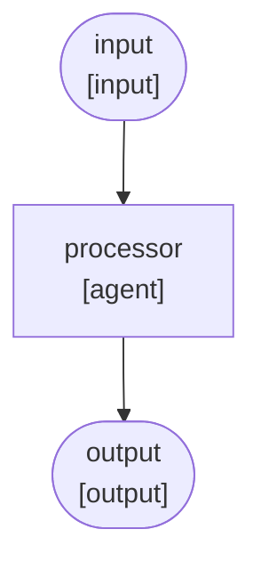
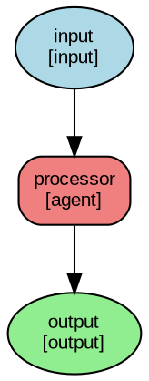

# Graph Visualization Guide

GenXAI provides powerful built-in visualization capabilities for graph-based workflows, similar to LangGraph but tailored for the GenXAI framework.

## Overview

The `Graph` class includes four visualization methods:

1. **`draw_ascii()`** - ASCII art representation for console output
2. **`to_mermaid()`** - Mermaid diagram syntax for documentation
3. **`to_dot()`** - GraphViz DOT format for professional diagrams
4. **`print_structure()`** - Simple text summary for quick overview

## Quick Start

```python
from genxai.core.graph.engine import Graph
from genxai.core.graph.nodes import InputNode, AgentNode, OutputNode
from genxai.core.graph.edges import Edge

# Create a graph
graph = Graph(name="my_workflow")
graph.add_node(InputNode("input"))
graph.add_node(AgentNode("processor", "my_agent"))
graph.add_node(OutputNode("output"))
graph.add_edge(Edge(source="input", target="processor"))
graph.add_edge(Edge(source="processor", target="output"))

# Visualize it!
print(graph.draw_ascii())
```

## Visualization Methods

### 1. ASCII Art Visualization

**Method:** `graph.draw_ascii()`

**Best for:** Quick console debugging, terminal output, logs

**Features:**
- Tree-based layout showing workflow structure
- Status indicators for each node:
  - `○` - PENDING
  - `◐` - RUNNING
  - `●` - COMPLETED
  - `✗` - FAILED
  - `⊘` - SKIPPED
- Shows parallel execution with `║` and `╠══`
- Indicates conditional edges with `[IF condition]`
- Detects and marks cycles with `↻`

**Example Output:**
```
Graph: sequential_workflow
============================================================

└── ○ input [input]
    └── ○ collector [agent]
        └── ○ processor [agent]
            └── ○ analyzer [agent]
                └── ○ output [output]

============================================================
Total Nodes: 5 | Total Edges: 4
```

### 2. Mermaid Diagram Syntax

**Method:** `graph.to_mermaid()`

**Best for:** Documentation, README files, GitHub wikis, web pages

**Features:**
- Standard Mermaid flowchart syntax
- Different shapes for different node types:
  - `([...])` - INPUT/OUTPUT nodes (stadium shape)
  - `{{...}}` - CONDITION nodes (diamond shape)
  - `[...]` - AGENT/TOOL nodes (rectangle)
- Conditional edges shown with `-->|conditional|`
- Parallel edges shown with `-.parallel.->`

**Example Output:**


**Usage:**
1. Copy the output
2. Paste into [Mermaid Live Editor](https://mermaid.live/)
3. Or embed in Markdown files (GitHub, GitLab, etc.)

### 3. GraphViz DOT Format

**Method:** `graph.to_dot()`

**Best for:** Professional presentations, publications, high-quality diagrams

**Features:**
- Industry-standard DOT format
- Color-coded nodes by type:
  - INPUT: Light blue ellipse
  - OUTPUT: Light green ellipse
  - CONDITION: Light yellow diamond
  - AGENT: Light coral rounded box
  - TOOL: Light gray box
  - HUMAN: Light pink box
  - SUBGRAPH: Lavender 3D box
- Shows node status in labels
- Conditional edges: dashed lines
- Parallel edges: blue lines
- Priority-based edge weights

**Example Output:**


**Rendering:**
```bash
# Save to file
echo "$DOT_OUTPUT" > workflow.dot

# Render to PNG
dot -Tpng workflow.dot -o workflow.png

# Render to SVG
dot -Tsvg workflow.dot -o workflow.svg

# Render to PDF
dot -Tpdf workflow.dot -o workflow.pdf
```

### 4. Structure Summary

**Method:** `graph.print_structure()`

**Best for:** Quick debugging, understanding graph composition

**Features:**
- Node count and edge count
- Complete list of nodes with types and statuses
- Complete list of edges with conditions
- Entry and exit points identification

**Example Output:**
```
Graph: my_workflow
============================================================
Nodes: 5
Edges: 4

Node List:
------------------------------------------------------------
  • input                [input     ] (pending)
  • processor            [agent     ] (pending)
  • output               [output    ] (pending)

Edge List:
------------------------------------------------------------
  • input           → processor       (unconditional)
  • processor       → output          (unconditional)

Entry Points: input
Exit Points: output
============================================================
```

## Pattern Examples

### Sequential Pattern

```python
graph = Graph(name="sequential")
graph.add_node(InputNode("input"))
graph.add_node(AgentNode("step1", "agent1"))
graph.add_node(AgentNode("step2", "agent2"))
graph.add_node(OutputNode("output"))

graph.add_edge(Edge(source="input", target="step1"))
graph.add_edge(Edge(source="step1", target="step2"))
graph.add_edge(Edge(source="step2", target="output"))

print(graph.draw_ascii())
```

### Conditional Branching

```python
from genxai.core.graph.edges import ConditionalEdge

graph = Graph(name="conditional")
graph.add_node(InputNode("input"))
graph.add_node(ConditionNode("router", "route_logic"))
graph.add_node(AgentNode("path_a", "agent_a"))
graph.add_node(AgentNode("path_b", "agent_b"))
graph.add_node(OutputNode("output"))

graph.add_edge(Edge(source="input", target="router"))
graph.add_edge(ConditionalEdge(
    source="router",
    target="path_a",
    condition=lambda state: state.get("type") == "A"
))
graph.add_edge(ConditionalEdge(
    source="router",
    target="path_b",
    condition=lambda state: state.get("type") == "B"
))
graph.add_edge(Edge(source="path_a", target="output"))
graph.add_edge(Edge(source="path_b", target="output"))

print(graph.draw_ascii())
```

### Parallel Execution

```python
from genxai.core.graph.edges import ParallelEdge

graph = Graph(name="parallel")
graph.add_node(InputNode("input"))
graph.add_node(AgentNode("coordinator", "coordinator"))
graph.add_node(AgentNode("worker1", "worker_a"))
graph.add_node(AgentNode("worker2", "worker_b"))
graph.add_node(AgentNode("worker3", "worker_c"))
graph.add_node(AgentNode("aggregator", "aggregator"))
graph.add_node(OutputNode("output"))

graph.add_edge(Edge(source="input", target="coordinator"))
graph.add_edge(ParallelEdge(source="coordinator", target="worker1"))
graph.add_edge(ParallelEdge(source="coordinator", target="worker2"))
graph.add_edge(ParallelEdge(source="coordinator", target="worker3"))
graph.add_edge(Edge(source="worker1", target="aggregator"))
graph.add_edge(Edge(source="worker2", target="aggregator"))
graph.add_edge(Edge(source="worker3", target="aggregator"))
graph.add_edge(Edge(source="aggregator", target="output"))

print(graph.draw_ascii())
```

## Advanced Features

### Cycle Detection

The ASCII visualization automatically detects cycles and marks them:

```python
# Create a graph with a cycle
graph.add_edge(Edge(source="output", target="input"))  # Creates cycle

print(graph.draw_ascii())
# Output will show: ↻ (cycle detected)
```

### Status Visualization

Node statuses are automatically reflected in visualizations:

```python
# After execution
await graph.run(input_data)

# ASCII shows status with symbols
print(graph.draw_ascii())
# ● for completed nodes
# ✗ for failed nodes

# DOT includes status in labels
print(graph.to_dot())
# Labels show: "node_name\n[type]\n(completed)"
```

### Export to Files

```python
# Export Mermaid to Markdown
with open("workflow.md", "w") as f:
    f.write("# Workflow Diagram\n\n")
    f.write("```mermaid\n")
    f.write(graph.to_mermaid())
    f.write("\n```\n")

# Export DOT to file
with open("workflow.dot", "w") as f:
    f.write(graph.to_dot())

# Then render with GraphViz
# dot -Tpng workflow.dot -o workflow.png
```

## Comparison with LangGraph

| Feature | GenXAI | LangGraph |
|---------|--------|-----------|
| ASCII Art | ✅ `draw_ascii()` | ✅ `print_ascii()` |
| Mermaid | ✅ `to_mermaid()` | ✅ `draw_mermaid()` |
| GraphViz | ✅ `to_dot()` | ✅ `draw_png()` (requires graphviz) |
| Status Indicators | ✅ Built-in | ❌ Not included |
| Parallel Edges | ✅ Explicit visualization | ⚠️ Limited |
| Cycle Detection | ✅ Automatic | ⚠️ Manual |
| Dependencies | ✅ None (pure Python) | ⚠️ Requires graphviz for PNG |

## Best Practices

1. **Use `draw_ascii()` during development** for quick feedback
2. **Use `to_mermaid()` in documentation** for easy-to-read diagrams
3. **Use `to_dot()` for presentations** when you need professional quality
4. **Use `print_structure()` for debugging** to understand graph composition

## Demo Script

Run the complete demo to see all visualization methods in action:

```bash
python examples/graph_visualization_demo.py
```

This will demonstrate:
- Sequential workflows
- Conditional branching
- Parallel execution
- Complex multi-pattern workflows

## Troubleshooting

### GraphViz Not Rendering

If `dot` command is not found:

```bash
# macOS
brew install graphviz

# Ubuntu/Debian
sudo apt-get install graphviz

# Windows
choco install graphviz
```

### Mermaid Not Displaying

Ensure your Markdown viewer supports Mermaid:
- GitHub: ✅ Native support
- GitLab: ✅ Native support
- VS Code: Install "Markdown Preview Mermaid Support" extension
- Other: Use [Mermaid Live Editor](https://mermaid.live/)

## See Also

- [Graph Engine Documentation](../genxai/core/graph/engine.py)
- [Node Types](../genxai/core/graph/nodes.py)
- [Edge Types](../genxai/core/graph/edges.py)
- [Workflow Patterns](../examples/patterns/)
